# End-to-End Image Pipeline Demo

> **Reusable Workflows:** https://github.com/sonupreetam/org-infra-tests
> **Workflow Files:** `publish-images-local.yml` and `promote-to-quay-local.yml`
> **Target Registries:** GHCR (staging) → Quay.io (production)

## 🎯 Why Use the Local Files?

The `-local.yml` workflow files are **already configured** for your demo:

| File | Points To |
|------|-----------|
| `publish-images-local.yml` | `sonupreetam/org-infra-tests/.github/workflows/ci_publish_images.yml@main` |
| `promote-to-quay-local.yml` | `sonupreetam/org-infra-tests/.github/workflows/reusable_promote.yml@main` |
| | `sonupreetam/org-infra-tests/.github/workflows/reusable_sign_and_verify.yml@main` |

**Images are configured as:**
- Source: `ghcr.io/sonupreetam/test-compass`, `ghcr.io/sonupreetam/test-beacon-distro`
- Destination: `quay.io/test_complytime/test-compass`, `quay.io/test_complytime/test-beacon-distro`

No need to create separate demo workflows - just use what's already there!

---

## 📊 Architecture Diagrams

### High-Level Pipeline Flow

```mermaid
flowchart TB
    subgraph trigger["🎯 Triggers"]
        push["Push to main"]
        tag["Tag: test-v*.*.*"]
        manual["Manual Dispatch"]
        schedule["Scheduled (30 days)"]
    end

    subgraph publish["📦 Publish Images Workflow"]
        direction TB
        build_compass["Build Compass Image"]
        build_beacon["Build Beacon-Distro Image"]
        
        subgraph ci_publish["ci_publish_images.yml (Reusable)"]
            checkout["Checkout Code"]
            validate["Pre-flight Validation"]
            buildx["Docker Buildx Build"]
            scan["Trivy Security Scan"]
            sbom["Generate SBOM"]
            sign_ghcr["Sigstore Keyless Sign"]
            attest["Create Attestations"]
            push_ghcr["Push to GHCR"]
            verify["Verify Signature"]
        end
    end

    subgraph promote["🚀 Promote to Quay Workflow"]
        direction TB
        promote_compass["Promote Compass"]
        sign_compass_quay["Sign Compass @Quay"]
        promote_beacon["Promote Beacon-Distro"]
        sign_beacon_quay["Sign Beacon @Quay"]
        
        subgraph reusable_promote["reusable_promote.yml"]
            verify_source["Verify Source Signature"]
            copy_image["Copy Image (skopeo)"]
            create_tags["Create Semver Tags"]
        end
        
        subgraph reusable_sign["reusable_sign_and_verify.yml"]
            cosign_sign["Cosign Keyless Sign"]
            cosign_verify["Verify Signature"]
        end
    end

    subgraph registries["🗄️ Container Registries"]
        ghcr[("GHCR\nghcr.io/sonupreetam/test-*")]
        quay[("Quay.io\nquay.io/test_complytime/test-*")]
    end

    push --> publish
    tag --> publish
    tag --> promote
    manual --> publish
    manual --> promote
    schedule --> publish

    build_compass --> ci_publish
    build_beacon --> ci_publish
    ci_publish --> ghcr

    promote_compass --> reusable_promote
    promote_beacon --> reusable_promote
    reusable_promote --> reusable_sign
    
    ghcr --> reusable_promote
    reusable_sign --> quay

    style trigger fill:#e1f5fe
    style publish fill:#fff3e0
    style promote fill:#e8f5e9
    style registries fill:#fce4ec
```



### Detailed Build & Sign Flow


### Promotion Flow


---

## 🎪 Demo Scenario: Complete Pipeline Walkthrough

### Prerequisites

1. **Repositories Setup:**
   - Fork/clone the demo repository
   - Ensure `sonupreetam/org-infra-tests` has the reusable workflows
   
2. **Secrets Required:**
   - `QUAY_USERNAME` - Quay.io robot account username
   - `QUAY_PASSWORD` - Quay.io robot account password
   
3. **Quay.io Setup:**
   - Create organization `test_complytime`
   - Create repositories: `test-compass`, `test-beacon-distro`

---

## 📁 Containerfiles Used

The demo uses the **existing production Containerfiles** already configured in `publish-images-local.yml`:

| Component | Containerfile | Description |
|-----------|---------------|-------------|
| Compass | `compass/images/Containerfile.compass` | Multi-stage Go build with distroless base |
| Beacon-Distro | `beacon-distro/Containerfile.collector` | Multi-stage OTel collector build |

### Key Features Demonstrated by These Containerfiles:

1. **Multi-stage builds** - Separate build and runtime stages
2. **Distroless base images** - Minimal attack surface
3. **Non-root execution** - Security best practice (USER 10001)
4. **Build cache optimization** - `--mount=type=cache` for faster rebuilds
5. **OCI labels** - Proper metadata for image registries

---

## 🚀 Step-by-Step Demo Execution

### Phase 1: Publish Images to GHCR

> **Workflow:** `.github/workflows/publish-images-local.yml`

**Trigger Method 1: Push to main**
```bash
# Make a small change to trigger the workflow
git checkout main
touch .github/workflows/trigger-$(date +%s).md
git add .
git commit -m "chore: trigger publish workflow demo"
git push origin main
```

**Trigger Method 2: Manual Dispatch**
1. Go to Actions → **"Publish Images"** (from `publish-images-local.yml`)
2. Click "Run workflow"
3. Optionally check "Force rebuild without cache"

**Trigger Method 3: Tag Push**
```bash
git tag test-v0.0.1-demo
git push origin test-v0.0.1-demo
```

**What to Observe:**
- [ ] `build-compass` job starts → calls `ci_publish_images.yml`
- [ ] `build-beacon-distro` job starts (parallel) → calls `ci_publish_images.yml`
- [ ] Security scan results appear (Trivy → SARIF)
- [ ] Images pushed to `ghcr.io/sonupreetam/test-compass:sha-xxxxx`
- [ ] Sigstore keyless signatures attached
- [ ] SBOM and provenance attestations created
- [ ] Signature verification passes

### Phase 2: Promote Images to Quay.io

> **Workflow:** `.github/workflows/promote-to-quay-local.yml`

**Trigger: Create Release Tag**
```bash
# Tag must match pattern: test-v*.*.*
git tag test-v1.0.0
git push origin test-v1.0.0
```

**Alternative: Manual Dispatch with Specific SHA**
1. Go to Actions → **"Promote to Quay"** (from `promote-to-quay-local.yml`)
2. Click "Run workflow"
3. Optionally provide `source_sha` from a previous build

**What to Observe:**
- [ ] `promote-compass` job → calls `reusable_promote.yml`
  - [ ] Verifies source signature on GHCR
  - [ ] Copies image to Quay via skopeo
  - [ ] Creates semver tags: `test-v1`, `test-v1.0`, `test-v1.0.0`
- [ ] `sign-compass` job → calls `reusable_sign_and_verify.yml`
  - [ ] Re-signs image at Quay with keyless signing
  - [ ] Verifies new signature
- [ ] Same flow repeats for beacon-distro (parallel)

---

## ✅ Reusable Workflow Coverage Matrix

| Feature | Workflow | Demo Trigger |
|---------|----------|--------------|
| **Docker Buildx** | `ci_publish_images.yml` | Push to main |
| **Multi-arch builds** | `ci_publish_images.yml` | Push to main |
| **Trivy Security Scan** | `ci_publish_images.yml` | Push to main |
| **SARIF Upload** | `ci_publish_images.yml` | Push to main |
| **SBOM Generation** | `ci_publish_images.yml` | Push to main |
| **Sigstore Keyless Signing** | `ci_publish_images.yml` | Push to main |
| **Attestations** | `ci_publish_images.yml` | Push to main |
| **Signature Verification** | `ci_publish_images.yml`, `reusable_promote.yml` | Any |
| **Cross-registry Promotion** | `reusable_promote.yml` | Tag push |
| **Semver Tag Management** | `reusable_promote.yml` | Tag push |
| **Re-signing at Destination** | `reusable_sign_and_verify.yml` | Tag push |
| **OIDC Identity Verification** | All workflows | Any |
| **Cache Optimization** | `ci_publish_images.yml` | Push to main |
| **Concurrency Control** | All workflows | Rapid pushes |

---

## 🔍 Verification Commands

After the pipeline runs, verify the artifacts:

### Check GHCR Image Signatures
```bash
# Verify signature exists
cosign verify \
  --certificate-identity-regexp="https://github.com/sonupreetam/org-infra-tests(/.*)?>" \
  --certificate-oidc-issuer="https://token.actions.githubusercontent.com" \
  ghcr.io/sonupreetam/test-compass:sha-<COMMIT_SHA>

# List attestations
cosign tree ghcr.io/sonupreetam/test-compass:sha-<COMMIT_SHA>
```

### Check Quay.io Image Signatures
```bash
# Verify promoted image signature
cosign verify \
  --certificate-identity-regexp="https://github.com/sonupreetam/org-infra-tests(/.*)?>" \
  --certificate-oidc-issuer="https://token.actions.githubusercontent.com" \
  quay.io/test_complytime/test-compass:v1.0.0
```

### Inspect SBOM
```bash
# Download and inspect SBOM attestation
cosign download attestation \
  ghcr.io/sonupreetam/test-compass:sha-<COMMIT_SHA> | \
  jq -r '.payload' | base64 -d | jq '.predicate'
```

---

## 📋 Demo Presentation Script

### Slide 1: Introduction (2 min)
- Problem: Manual image builds lack security, consistency
- Solution: Automated pipeline with signing & attestations

### Slide 2: Architecture Overview (3 min)
- Show the high-level mermaid diagram
- Explain GHCR → Quay promotion pattern

### Slide 3: Live Demo - Publish (5 min)
- Trigger manual workflow dispatch
- Show parallel job execution
- Highlight security scan results
- Point out signature creation

### Slide 4: Live Demo - Promote (5 min)
- Create a release tag
- Show source signature verification
- Watch image promotion
- Verify semver tags created

### Slide 5: Verification (3 min)
- Run cosign verify commands
- Show attestation tree
- Inspect SBOM contents

### Slide 6: Security Features Deep Dive (5 min)
- Keyless signing with Sigstore
- OIDC identity binding
- Supply chain transparency

### Slide 7: Q&A (5 min)

---

## 🔧 Troubleshooting

### Common Issues

**1. "Source image not found"**
- Ensure publish workflow completed successfully before promoting
- Check the `source_tag` matches: `sha-<COMMIT_SHA>`

**2. "Signature verification failed"**
- Check `allowed_identity_regex` matches the workflow repository
- Ensure OIDC issuer is correct

**3. "Permission denied on Quay"**
- Verify robot account has write access
- Check repository exists in Quay

**4. "Concurrency timeout"**
- Previous workflow may be holding the lock
- Cancel stale workflows or wait

---

## 🎯 Key Talking Points

1. **Zero-trust supply chain** - Every image is signed and verified
2. **Keyless signing** - No long-lived keys to manage
3. **SBOM transparency** - Know exactly what's in your images
4. **Multi-registry strategy** - Development in GHCR, production in Quay
5. **Semver automation** - Consistent versioning across releases
6. **Security scanning** - Catch vulnerabilities before deployment
